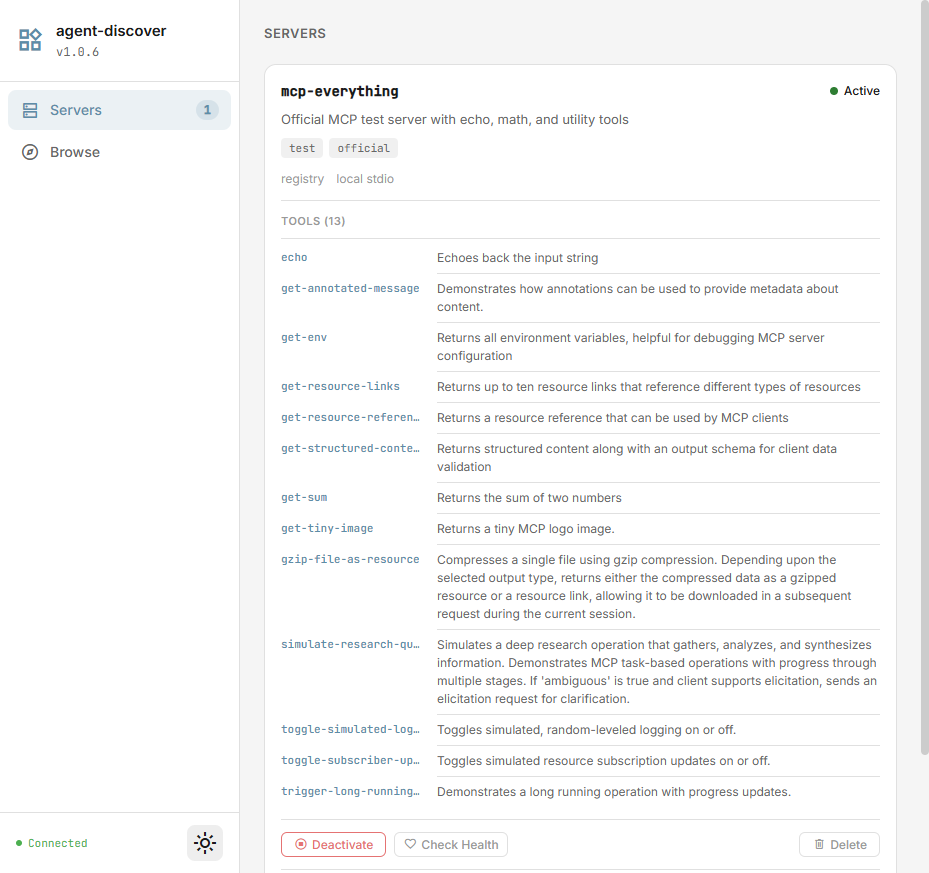
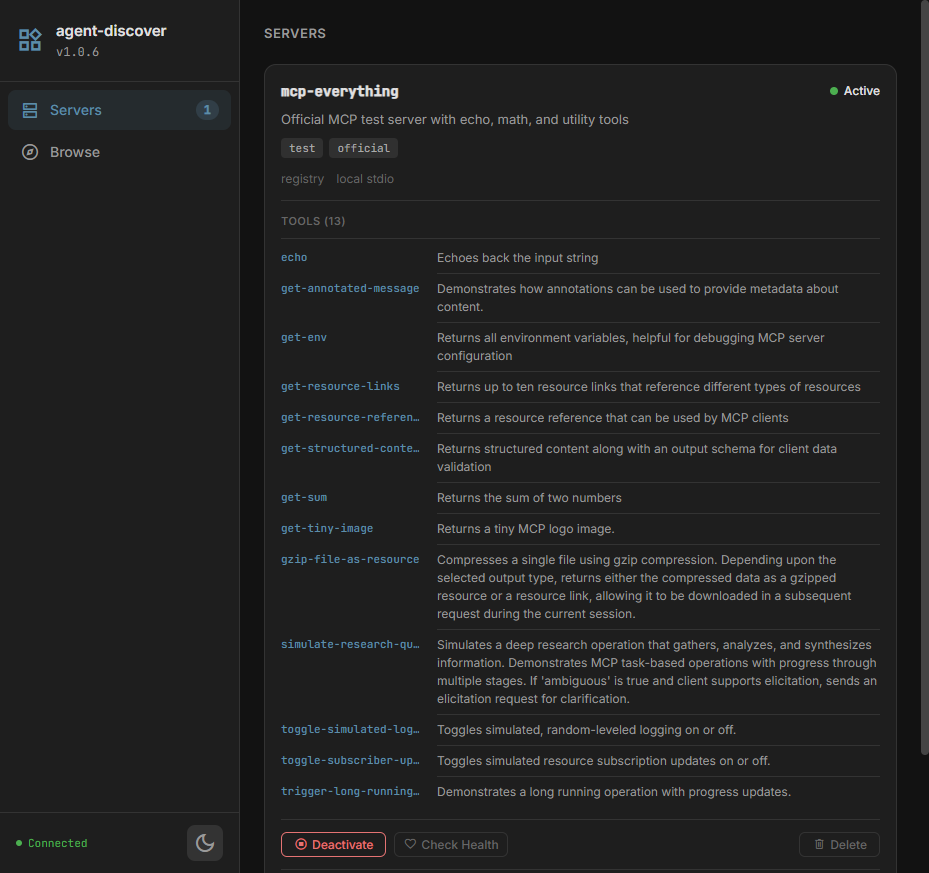

# agent-discover

[](LICENSE)
[](https://nodejs.org/)
[]()
[]()
[]()
[]()

**MCP server registry and marketplace.** Discover, install, activate, and manage MCP tools on demand. Acts as a dynamic proxy -- activated servers have their tools merged into the registry's own tool list, so agents can use them without restarting.

> **Every MCP client today — Claude Code, Cursor, Codex CLI, Aider, Continue, plain MCP clients — requires a full agent-session restart to pick up a newly registered MCP server.** The tool catalog is frozen at startup. agent-discover is the only path to register a new server and have it become discoverable in the same running session. This is the one differentiator that survives against every host, even those with their own built-in deferred-tool loaders.

Search spans the **official MCP registry**, **npm**, and **PyPI** in one query, so popular servers that aren't in the official index (Microsoft `@playwright/mcp`, `@modelcontextprotocol/server-*`, `mcp-server-fetch`, `mcp-server-git`, …) all show up.

Built for AI coding agents (Claude Code, Codex CLI, Gemini CLI, Aider) but works equally well with any MCP client, REST consumer, or WebSocket listener.

---

| Light Theme                                | Dark Theme                               |
| ------------------------------------------ | ---------------------------------------- |
|  |  |

---

## Why

Static MCP configs mean every server is always running, even when unused. Adding a new server requires editing config files and restarting. There is no way to browse what is available or install new tools at runtime.

|                  | Without agent-discover            | With agent-discover                                        |
| ---------------- | --------------------------------- | ---------------------------------------------------------- |
| **Discovery**    | Must know server names in advance | Browse the official MCP registry, search by keyword        |
| **Installation** | Edit config files, restart agent  | One tool call installs and registers                       |
| **Activation**   | All servers always running        | Activate/deactivate on demand, tools appear/disappear live |
| **Secrets**      | API keys in config files or env   | Per-server secret storage, auto-injected on activation     |
| **Monitoring**   | No visibility into server health  | Health checks, per-tool metrics, error counts              |
| **Management**   | Manual config edits               | Dashboard + REST API for config, tags                      |

---

## Features

- **Single-call tool discovery (`find_tool`)** — hybrid BM25 + semantic ranking returns the top match with a confidence label, compact `required_args`, and 4 ranked alternatives. Auto-activates the owning child server so the agent can call the proxied tool immediately on the next turn. Replaces the multi-step `search → list → activate` dance with one round-trip.
- **Batch discovery (`find_tools`)** — pass an array of intents to discover N tools in a single round-trip for multi-step tasks.
- **Indirect invocation (`proxy_call`)** — call a discovered tool **through** agent-discover without exposing it to the host catalog. Keeps the host MCP surface at exactly 5 actions regardless of how many tools the registered child servers expose — critical for very large catalogs where flooding the host with thousands of schemas would blow the model's context budget.
- **Pluggable embeddings (`AGENT_DISCOVER_EMBEDDING_PROVIDER`)** — semantic search is opt-in via `none` (default, BM25 only) / `local` (Xenova/all-MiniLM-L6-v2 via `@huggingface/transformers`) / `openai` (`text-embedding-3-small`). Provider failures fall back to BM25 cleanly. Mirrors agent-knowledge's pattern so the same model can be reused.
- **`did_you_mean` recovery** — when a proxied tool call fails, the proxy attaches BM25-ranked similar-tool suggestions to the error response so the agent can correct in one extra turn instead of giving up.
- **Local registry** -- register MCP servers in a SQLite database with name, command, args, env, tags
- **Federated marketplace search** -- a single query hits the official MCP registry, npm, and PyPI in parallel, dedupes by `<source>:<name>`, and collapses version duplicates
- **PyPI integration** -- curated list of well-known Python MCP servers (`mcp-server-fetch`, `mcp-server-git`, `mcp-server-time`, `mcp-server-postgres`, `mcp-server-sqlite`, `mcp-proxy`, …) plus live metadata via the PyPI JSON API; Python entries install via `uvx`
- **npm fallback** -- two parallel npm searches (`keywords:mcp` and `<query> mcp`) catch packages that didn't tag themselves (e.g. Microsoft `@playwright/mcp`)
- **Prereqs probe** -- `GET /api/prereqs` reports which package managers (`npx`, `uvx`, `docker`, `uv`) are available on the host; the dashboard surfaces a banner when something needed for an install is missing
- **Cross-process activation** -- the `active` flag is the source of truth in SQLite; every fresh agent-discover process hydrates its in-memory proxy from the DB on startup, so tools activated in one process show up in others
- **On-demand activation** -- activate/deactivate servers at runtime; their tools appear and disappear dynamically with `tools/list_changed` notifications
- **Tool proxying** -- activated server tools are namespaced as `serverName__toolName` and merged into the tool list
- **Multi-transport** -- stdio, SSE, and streamable-http transports for connecting to child servers
- **Secret management** -- store API keys and tokens per server, automatically injected as env vars (stdio) or HTTP headers (SSE/streamable-http) on activation; CRLF-validated to prevent header injection
- **Health checks** -- connect/disconnect probes for inactive servers, tool-list checks for active ones, with error count tracking
- **Per-tool metrics** -- call counts, error counts, and average latency recorded automatically on every proxied tool call
- **Full-text search** -- FTS5 search across server names, descriptions, and tags + cross-server tool index for `find_tool`
- **Pre-download** -- fire-and-forget `npm cache add` (npx servers) or `uv tool install` (uvx servers) on registration, plus a dedicated `/preinstall` endpoint
- **Real-time dashboard** -- web UI at http://localhost:3424 with Servers and Browse tabs, dark/light theme, WebSocket updates
- **MCP Inspector-grade Test panel** -- every active server card grows a Test drawer with seven subtabs (Tools / Info / Resources / Prompts / Events / Export / Diagnostics). Schema-driven form renderer, Pretty/Raw JSON/cURL result modes, live notification + progress streaming, localStorage presets, pop-out floating panel for side-by-side debugging, and a `Test ad-hoc` button that spins up a throwaway (never-registered) server with a 15-minute TTL. Covers the same surface as upstream `@modelcontextprotocol/inspector` without a second process or second port.
- **3 transport layers** -- MCP (stdio), REST API (HTTP), WebSocket (real-time events)
- **Declarative setup file** -- set `AGENT_DISCOVER_SETUP_FILE` to a JSON file listing servers to ensure-registered on startup. Idempotent (skips existing). Supports `auto_activate`, env var secret refs (`$VAR`), and tags. Automatically also reads a `.local.json` variant (e.g. `discover-setup.local.json`) for machine-specific servers with secrets. New `registry({ action: "sync" })` MCP action and `POST /api/sync` REST endpoint for on-demand re-read.
- **Bench harness** -- under `bench/`, comparing eager tool loading vs deferred discovery against real OpenCode + gpt-5-mini. Reproducible structural result: discover's first-turn input tokens are flat in N (~20.8k across N ∈ {10, 100, 1000, 3000}); eager's grow linearly (20.9k → 32.4k → 160.9k → context overflow at N=3000). End-to-end accuracy and multi-turn cost numbers are noisier and model-dependent — see [`bench/README.md`](bench/README.md) for what reproduces and what doesn't.

---

## Quick Start

### Install from npm

```bash
npm install -g agent-discover
```

### Or run directly with npx

```bash
npx agent-discover
```

### Or clone from source

```bash
git clone https://github.com/keshrath/agent-discover.git
cd agent-discover
npm install
npm run build
```

### Option 1: MCP server (for AI agents)

Add to your MCP client config (Claude Code, Cline, Cursor, Windsurf, etc.):

```json
{
  "mcpServers": {
    "agent-discover": {
      "command": "npx",
      "args": ["agent-discover"]
    }
  }
}
```

The dashboard auto-starts at http://localhost:3424 on the first MCP connection.

### Option 2: Standalone server (for REST/WebSocket clients)

```bash
node dist/server.js --port 3424
```

---

## MCP Tools (1)

A single action-based tool handles every operation via the `action` parameter — this keeps the prompt-overhead cost minimal regardless of how many child servers are registered.

| Action       | Purpose                                                                                                                                                               |
| ------------ | --------------------------------------------------------------------------------------------------------------------------------------------------------------------- |
| `find_tool`  | **Single-call discovery.** Hybrid BM25 + semantic search → top match + confidence label + compact `required_args` + 4 alternatives. Auto-activates the owning server. |
| `find_tools` | **Batch discovery.** Pass `intents: [...]` to discover N tools in one round-trip. Use for multi-step tasks.                                                           |
| `get_schema` | Full `input_schema` for a discovered tool. Only needed when the compact `required_args` summary isn't enough (conditional / polymorphic args).                        |
| `proxy_call` | Invoke a discovered tool **through** agent-discover without exposing it to the host catalog. Pair with `find_tool({auto_activate: false})` for huge catalogs.         |
| `list`       | Search the local registry by server (FTS5).                                                                                                                           |
| `install`    | Add a server from the marketplace or via manual config (command + args + env).                                                                                        |
| `uninstall`  | Remove a server.                                                                                                                                                      |
| `activate`   | Start a server, discover its tools, expose them to the host as `serverName__toolName`.                                                                                |
| `deactivate` | Stop a server, hide its tools.                                                                                                                                        |
| `browse`     | Federated search across the official MCP registry, npm, and PyPI.                                                                                                     |
| `status`     | Active servers summary (names, tool counts, tool lists).                                                                                                              |

Activated servers expose their tools through agent-discover, namespaced as `serverName__toolName`. For example, activating a server named `filesystem` that exposes `read_file` makes it available as `filesystem__read_file`.

When `find_tool` is called with `auto_activate: false` (recommended for catalogs above ~1k tools), the proxy connection is opened silently and tools must be invoked via `proxy_call` instead of being added to the host's catalog. This keeps the host MCP surface area constant regardless of how many tools the registered child servers expose.

---

## REST API (33 endpoints)

All endpoints return JSON. CORS enabled.

```
GET    /health                            Version, uptime
GET    /api/prereqs                       Probe host for npx/uvx/docker/uv availability
GET    /api/servers                       List servers (?query=, ?source=, ?installed=)
GET    /api/servers/:id                   Server details + tools
POST   /api/servers                       Register new server
PUT    /api/servers/:id                   Update server config (description, command, args, env, tags)
DELETE /api/servers/:id                   Unregister (deactivates first if active)
POST   /api/servers/:id/activate          Activate -- start server, discover tools, begin proxying
POST   /api/servers/:id/deactivate        Deactivate -- stop server, remove tools
POST   /api/servers/:id/preinstall        Pre-download package (npm cache add for npx, uv tool install for uvx)
GET    /api/servers/:id/secrets           List secrets (masked values)
PUT    /api/servers/:id/secrets/:key      Set a secret (upsert)
DELETE /api/servers/:id/secrets/:key      Delete a secret
POST   /api/servers/:id/health            Run health check (connect/disconnect probe)
GET    /api/servers/:id/metrics           Per-tool metrics for a server (call count, errors, latency)
GET    /api/metrics                       Metrics overview across all servers
GET    /api/browse                        Federated search: official registry + npm + PyPI (?query=, ?limit=, ?cursor=)
GET    /api/npm-check                     Check if an npm package exists (?package=)
GET    /api/status                        Active servers summary (names, tool counts, tool lists)

Tester surface (MCP Inspector parity — localhost-only unless AGENT_DISCOVER_ALLOW_REMOTE_TEST=1):
GET    /api/servers/:id/info               Server name, version, capabilities, instructions
GET    /api/servers/:id/tools               Live tools (bypasses activation cache)
POST   /api/servers/:id/call                Call a tool
GET    /api/servers/:id/resources           List resources (?cursor=...)
GET    /api/servers/:id/resource-templates  List resource templates
POST   /api/servers/:id/resource/read       Read a resource
POST   /api/servers/:id/resource/subscribe  Subscribe to resource updates
POST   /api/servers/:id/resource/unsubscribe  Unsubscribe
GET    /api/servers/:id/prompts             List prompts (?cursor=...)
POST   /api/servers/:id/prompt/get          Get a prompt with args
POST   /api/servers/:id/ping                Ping — returns { ok, rtt_ms }
POST   /api/servers/:id/logging-level       Set server logging level
GET    /api/servers/:id/export              Export config (?format=mcp-json|claude-code|cursor|agent-discover)
POST   /api/transient                        Activate an ad-hoc server (returns { handle, ... })
DELETE /api/transient/:handle                Release transient server
GET    /api/transient/:handle/*              Same tester surface, keyed by handle
GET    /api/roots                            Configured client roots (AGENT_DISCOVER_ROOTS)
GET    /api/logs/notifications               Notification log entries
GET    /api/logs/progress                    Progress log entries
```

---

## Dashboard

The web dashboard auto-starts at **http://localhost:3424** and provides two views:

**Servers tab** -- all registered servers as cards showing health dots, error counts, active/inactive status, description, tags, tools list, and expandable Secrets/Metrics/Config sections. Action buttons for activate, deactivate, health check, and delete.

**Browse tab** -- federated search across the official MCP registry, npm, and PyPI. Each card shows the runtime tag (`node`, `python`, `streamable-http`, …), version, description, and an install button that picks the right command (`npx`, `uvx`, or remote URL) automatically. A prereq banner at the top of the tab warns when a required package manager (`npx`, `uvx`, `docker`) is missing on the host.

Real-time updates via WebSocket with 2-second database polling. Dark and light themes with persistent preference.

---

## Testing

```bash
npm test              # 179 tests across 12 files
npm run test:watch    # Watch mode
npm run test:coverage # Coverage report
npm run check         # Full CI: typecheck + lint + format + test
npm run test:e2e:ui   # Playwright dashboard smoke tests
```

---

## Environment Variables

### Core

| Variable                           | Default                       | Description                                                                                                 |
| ---------------------------------- | ----------------------------- | ----------------------------------------------------------------------------------------------------------- |
| `AGENT_DISCOVER_PORT`              | `3424`                        | Dashboard HTTP port                                                                                         |
| `AGENT_DISCOVER_DB`                | `~/.claude/agent-discover.db` | SQLite database path                                                                                        |
| `AGENT_DISCOVER_ROOTS`             | —                             | Comma-separated root URIs advertised to child servers (e.g. `file:///Users/me/repo,file:///Users/me/data`)  |
| `AGENT_DISCOVER_ALLOW_REMOTE_TEST` | `0`                           | Set to `1` to allow the Test panel endpoints from non-loopback origins. **Not recommended** — see Security. |

### Embeddings (semantic search for `find_tool`)

Embeddings are **opt-in**. The default is `none`, which means `find_tool` ranks by BM25 + verb synonyms only. Setting a provider enables hybrid BM25 + cosine retrieval, which closes the natural-language gap (e.g. "billing arrangement" → "subscription") that BM25 alone misses.

| Variable                                | Default | Description                                                             |
| --------------------------------------- | ------- | ----------------------------------------------------------------------- |
| `AGENT_DISCOVER_EMBEDDING_PROVIDER`     | `none`  | `none` \| `local` \| `openai`                                           |
| `AGENT_DISCOVER_EMBEDDING_MODEL`        | —       | Override the default model id for the chosen provider                   |
| `AGENT_DISCOVER_EMBEDDING_THREADS`      | `1`     | Local provider only — onnx runtime thread count                         |
| `AGENT_DISCOVER_EMBEDDING_IDLE_TIMEOUT` | `60`    | Local provider only — seconds before unloading the model from RAM       |
| `AGENT_DISCOVER_OPENAI_API_KEY`         | —       | OpenAI API key for embeddings (falls back to `OPENAI_API_KEY` if unset) |

**Local provider** uses `Xenova/all-MiniLM-L6-v2` (384 dims) via `@huggingface/transformers`. Install the optional peer dependency with `npm install @huggingface/transformers` if you want to use it. No network calls, no API key.

**OpenAI provider** uses `text-embedding-3-small` (1536 dims). Same model as agent-knowledge so the two servers can share an embedding key.

### Host package manager prerequisites

agent-discover spawns child MCP servers via the host's installed package managers. Install whatever you intend to use; missing tools are reported by `GET /api/prereqs` and surfaced as a banner in the Browse tab.

| Tool     | Used for                        | Install hint                                          |
| -------- | ------------------------------- | ----------------------------------------------------- |
| `npx`    | npm-published MCP servers       | ships with [Node.js](https://nodejs.org/)             |
| `uvx`    | PyPI-published MCP servers      | install [uv](https://docs.astral.sh/uv/)              |
| `docker` | Docker-image MCP servers (rare) | install [Docker](https://docs.docker.com/get-docker/) |

---

## Documentation

- [User Manual](docs/USER-MANUAL.md) -- comprehensive guide covering all tools, REST API, dashboard, and troubleshooting
- [API Reference](docs/API.md) -- all MCP tools and REST endpoints
- [Architecture](docs/ARCHITECTURE.md) -- source structure, design principles, database schema
- [Dashboard](docs/DASHBOARD.md) -- web UI views and features
- [Setup Guide](docs/SETUP.md) -- installation, client setup (Claude Code, Cursor, Windsurf)
- [Changelog](CHANGELOG.md)

---

## License

MIT -- see [LICENSE](LICENSE)
