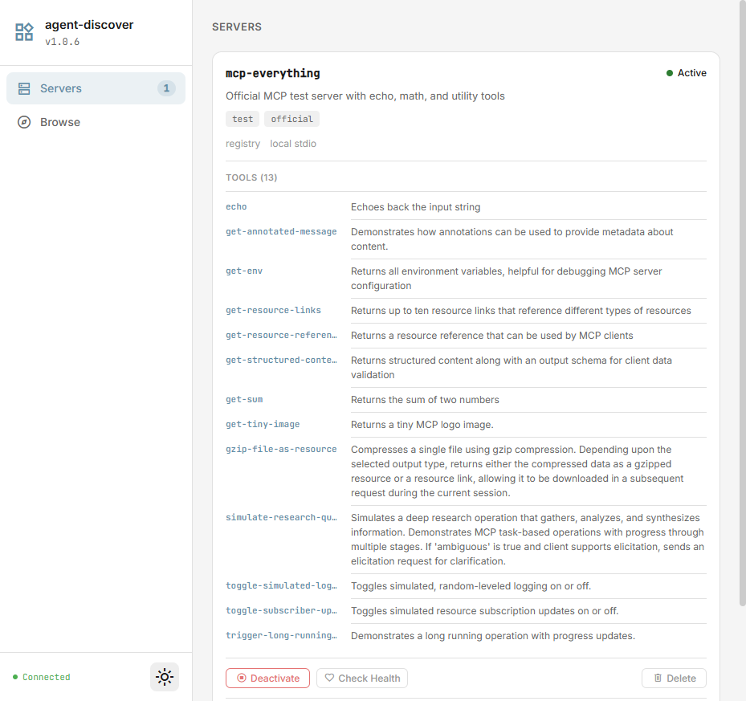
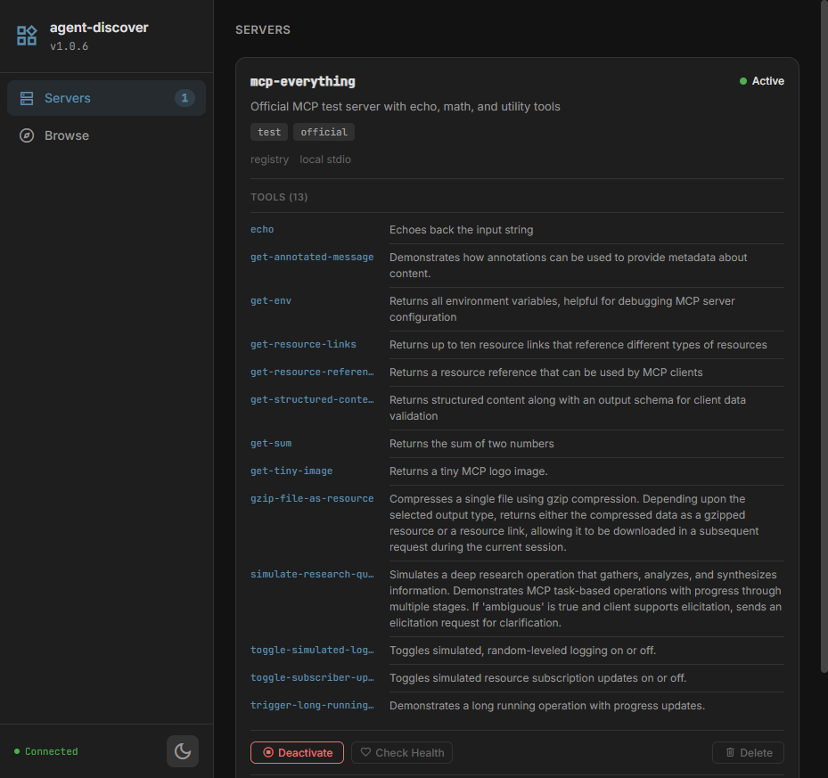

# agent-discover

[](LICENSE)
[](https://nodejs.org/)
[]()
[]()

**Find, install and enable MCP servers in the middle of a session, on any MCP host.** agent-discover is one local daemon that searches the official MCP Registry, npm and PyPI, installs a server after you approve the exact command and its provenance, and then exposes its tools to your host without a config edit or a restart. It also guards what it installs: tool definitions are pinned and a server whose tools change is quarantined, secrets live in the OS keychain, and every action is audited.

| Light Theme                                | Dark Theme                               |
| ------------------------------------------ | ---------------------------------------- |
|  |  |

---

## Why

Current hosts (Claude Code, Codex, the Anthropic and OpenAI APIs) have their own tool search, so agent-discover is not mainly about saving prompt tokens any more. What a host's tool search cannot do is work with a server you have not installed yet. Adding a new MCP server still means editing the host's config and restarting the session. agent-discover removes that step:

- **Discover.** One query searches your installed servers' tool index and the public registries (a local mirror of the official MCP Registry, plus npm and PyPI).
- **Install with consent.** `install_server` shows you the exact command or URL, the env and header names, the pinned version and the provenance checks (registry namespace, npm `mcpName`, PyPI, OCI label). Nothing runs until you accept.
- **Enable and disable at runtime**, including servers that were installed a minute ago. Enabling indexes the server first if needed.
- **Feed the host's own tool search.** In `native` mode (the default) every enabled server's tools are listed as `<server>__<tool>` and agent-discover sends `notifications/tools/list_changed` on each change, so the host's native tool search, permission prompts and `alwaysLoad` settings keep working. In `proxy` mode only eight meta tools are listed and everything goes through `call_tool`, for hosts with weak or no tool search.
- **Stay in control.** See [Trust layer](#trust-layer).

|                   | Static MCP config                  | With agent-discover                                           |
| ----------------- | ---------------------------------- | ------------------------------------------------------------- |
| **Discovery**     | Know the server name in advance    | Search the registries by need, with provenance                |
| **Installation**  | Edit config, restart the session   | One tool call, you approve the exact command                  |
| **Enablement**    | All configured servers always load | Enable and disable mid-session; the index stays searchable    |
| **Secrets**       | Keys in config files or env        | OS keychain (or an encrypted file), injected on connect       |
| **Changed tools** | Silent                             | Pinned hashes, drift quarantines the server until you approve |
| **Visibility**    | Per-host logs                      | Dashboard, health, per-tool metrics, audit log, OpenTelemetry |

---

## Quick Start

### Claude Code

Install the plugin. It runs the stdio shim as the MCP server, adds the `find`, `install` and `dashboard` skills, a SessionStart hook and a native UI:

```bash
claude plugin marketplace add keshrath/agent-discover
claude plugin install agent-discover@agent-discover
```

- `/discover [what you need]` opens a panel in the terminal, the desktop Code tab or VS Code: servers by state with health, Enable / Disable / Re-index buttons, a search box over installed tools and the registry, and Install buttons (the consent step still gates every install).
- A status line entry `MCP 2/6 !1`, a toast when a server is quarantined or goes unhealthy, and a band above the prompt that shows only while something needs you.
- The native UI needs Claude Code 2.1.289 or newer. Older builds keep the skills and tools.
- Remove any hand-written `agent-discover` entry from `~/.claude.json` so tools do not appear twice.

### Any other MCP host

```json
{
  "mcpServers": {
    "agent-discover": { "command": "npx", "args": ["-y", "agent-discover@^2"] }
  }
}
```

Hosts with Streamable HTTP can instead point at `http://127.0.0.1:3424/mcp` when the daemon already runs. Cursor, Codex, VS Code, Claude Desktop and the rest: [docs/SETUP.md](docs/SETUP.md#client-setup).

The dashboard is at http://127.0.0.1:3424.

### From source

```bash
git clone https://github.com/keshrath/agent-discover.git
cd agent-discover
npm install
npm run build
node dist/index.js daemon
```

---

## How it runs

One daemon per machine, `agent-discover daemon`, listens on `127.0.0.1:3424` and serves the dashboard, the REST API (`/api/*`), a WebSocket (`/ws`) and MCP Streamable HTTP at `/mcp`. `/mcp` speaks the 2026-07-28 protocol and the 2025 sessionful protocol on the same endpoint.

The default bin `agent-discover` is a thin stdio shim: it checks `/api/health`, starts the daemon if it is not running (lockfile-guarded, detached) and relays stdio to `/mcp`. Every host and every session shares the one daemon, so connection and enablement state has a single owner. The daemon exits after 30 minutes with no MCP streams and no dashboard clients (`AGENT_DISCOVER_IDLE_MS`).

Details: [docs/ARCHITECTURE.md](docs/ARCHITECTURE.md).

---

## MCP tools (8)

| Tool             | Purpose                                                                                                                                   |
| ---------------- | ----------------------------------------------------------------------------------------------------------------------------------------- |
| `search_servers` | Installed servers plus public registry / npm / PyPI matches, for something not installed yet.                                             |
| `install_server` | Install by exact registry, npm or PyPI name (version pinned) or from a manual command or URL. Asks you to confirm the plan, then indexes. |
| `enable_server`  | Expose a server's tools to the host. A quarantined server asks you to review a diff and re-approve first.                                 |
| `disable_server` | Stop exposing the tools. The server stays installed and searchable.                                                                       |
| `server_status`  | Installed / indexed / enabled / connected / quarantined, tool counts, flagged tools, health (`check_health` runs a live probe).           |
| `search_tools`   | Batch search (up to 10 queries) across the tool index of every installed server, enabled or not.                                          |
| `get_tool`       | Full definition of one indexed tool by server and name.                                                                                   |
| `call_tool`      | Call any indexed tool and return the upstream result unchanged. The way to call tools in `proxy` mode.                                    |

Prompts `discover`, `install` and `status` appear as slash commands in hosts that surface MCP prompts. All tools except `call_tool` declare an `outputSchema` and return `structuredContent` plus a markdown rendering.

**MCP Apps widget.** Tool results carry `ui://agent-discover/app.html`, a single widget that renders search results, server cards, install consent and a tool tester. Claude Desktop, claude.ai and VS Code render it. Claude Code does not render MCP Apps yet and shows the markdown instead.

Full schemas: [docs/API.md](docs/API.md).

---

## Trust layer

agent-discover sits between your host and MCP servers it did not write, so it assumes their descriptions are hostile. Full model: [docs/SECURITY.md](docs/SECURITY.md).

- **Install consent with provenance.** The plan shows the exact command, pinned version and registry namespace / package metadata checks. There is deliberately no agent-supplied `confirm` argument.
- **Tool pinning and quarantine.** The first index of a server pins a hash of every tool's description, input schema and annotations. Any later change, addition or removal quarantines the server until you re-approve it from a readable diff (or the tools revert).
- **Description hygiene.** Control, zero-width and bidi characters are stripped, descriptions are capped, and six heuristics flag likely prompt injection. Flags are advisory; pinning is the control.
- **Secrets** in the OS keychain, or an AES-256-GCM file when no keychain is available. Never in SQLite, never listed unmasked.
- **Audit log**, append-only, readable at `GET /api/audit`.
- **OpenTelemetry**, opt-in via `OTEL_EXPORTER_OTLP_ENDPOINT` or `AGENT_DISCOVER_OTEL=1`.
- **Loopback only.** Host / Origin allowlist, JSON-only bodies, and a per-launch token on every state-changing REST call.
- **OAuth 2.1 for remote servers** (discovery, PKCE, refresh, `iss` check), with sign-in handed to you as a URL; agent-discover never opens it itself.

Not covered in 2.0: sandboxing upstream stdio servers. They run with your user's privileges.

---

## Search quality

`search_tools` ranks with SQLite FTS5 (Porter stemming, fielded BM25 over name, description and argument names), typo repair, server routing and a small usage prior. A local or OpenAI embedding provider is opt-in and adds dense scores.

Measured on the retrieval bench in `bench/retrieval/`: 50 real MCP servers, 1674 tools, 468 hand-labelled queries (paraphrase, task, cross-server, multi-step, typo, German, and unanswerable). All tuning used the dev split; these numbers are the held-out test split (269 answerable queries).

| Ranker                                               |  R@1  |  R@5  | R@10  |  MRR  |
| ---------------------------------------------------- | :---: | :---: | :---: | :---: |
| plain BM25 (about what hosted BM25 tool search does) | 0.305 | 0.522 | 0.618 | 0.430 |
| agent-discover 1.x                                   | 0.307 | 0.561 | 0.642 | 0.446 |
| **agent-discover 2.0, zero config**                  | 0.338 | 0.576 | 0.661 | 0.474 |
| 2.0 + `multilingual-e5-small` (opt-in)               | 0.381 | 0.618 | 0.722 | 0.522 |

Read this honestly:

- The zero-config gain over plain BM25 is modest (+4 points R@10). The dense option adds about 6 more.
- It is retrieval only: no LLM chooses a tool, and the corpus is public servers with their real, uneven descriptions.
- The e5 row needs `npm install @huggingface/transformers` by hand (about 130 MB model, about 3 minutes to index 1674 tools on one thread) and is not run in CI.
- A 5-query-per-tool LLM enrichment of descriptions reached R@10 0.922 offline, but that is **bench-only** and not shipped: it needs an LLM at index time, and the labelled queries were also LLM-written, so treat it as an upper bound.
- No score floor is applied. No signal separated the unanswerable queries from answerable ones, so 2.0 returns the best matches rather than pretending to reject.

Methodology, per-category results and how to run it: [bench/retrieval/README.md](bench/retrieval/README.md). CI runs `npm run bench:retrieval -- --check`.

---

## Features

- **Local registry** in SQLite: servers, indexed tools, per-server secrets, metrics. Indexing is independent of enablement: install probes the server once, persists its tools and disconnects.
- **Registry mirror** of the official MCP Registry (v0.1 API) with incremental `updated_since` sync, deprecated and deleted status tracking, and exact-name installs. A server whose registry entry was deleted is flagged in `server_status`.
- **Federated search** over the registry mirror, npm and PyPI.
- **Transports to upstream servers**: stdio, SSE, streamable HTTP, both protocol eras negotiated automatically. Upstream `input_required` and 2025 `elicitation/create` requests are relayed to your client.
- **Lazy, pooled connections** with reconnect backoff, idle disconnect and real health probes.
- **Dashboard** with Servers, Browse and Logs, a per-server MCP Inspector style tester, dark and light themes.
- **Declarative setup file** (`AGENT_DISCOVER_SETUP_FILE`) listing servers to ensure installed at daemon start.
- **Per-tool metrics** and a call log.

---

## Environment variables

The common ones. The complete list is in [docs/API.md](docs/API.md#environment).

| Variable                            | Default                       | Description                                                              |
| ----------------------------------- | ----------------------------- | ------------------------------------------------------------------------ |
| `AGENT_DISCOVER_PORT`               | `3424`                        | Daemon port                                                              |
| `AGENT_DISCOVER_HOST`               | `127.0.0.1`                   | Listen address                                                           |
| `AGENT_DISCOVER_DB`                 | `~/.claude/agent-discover.db` | SQLite path (a 1.x database is migrated in place)                        |
| `AGENT_DISCOVER_MODE`               | `native`                      | `native` lists enabled servers' tools; `proxy` lists only the meta tools |
| `AGENT_DISCOVER_IDLE_MS`            | `1800000`                     | Daemon idle exit (`0` = never)                                           |
| `AGENT_DISCOVER_SETUP_FILE`         | unset                         | Declarative server list synced at start                                  |
| `AGENT_DISCOVER_EMBEDDING_PROVIDER` | `none`                        | `local` or `openai` adds semantic ranking                                |
| `AGENT_DISCOVER_SECRETS`            | auto                          | `keyring` or `file` forces the secret backend                            |

---

## Upgrading from 1.x

2.0 is a breaking release. The single `registry` tool is replaced by the eight tools above, REST routes were renamed, the setup file key `auto_activate` is now `enabled`, secrets move to the keychain, and the default bin is the shim. The database migrates itself. Full list in [CHANGELOG.md](CHANGELOG.md#200---unreleased).

---

## Testing

```bash
npm test              # 187 tests across 23 files
npm run check         # typecheck + lint + format + test
npm run bench:retrieval
npm run test:e2e:ui   # Playwright dashboard smoke tests
```

---

## Documentation

- [User Manual](docs/USER-MANUAL.md): day-to-day use
- [Setup Guide](docs/SETUP.md): installation and per-client configuration
- [API Reference](docs/API.md): MCP tools, REST, WebSocket, environment
- [Architecture](docs/ARCHITECTURE.md): process model, domain services, schema, search
- [Security](docs/SECURITY.md): trust model
- [Dashboard](docs/DASHBOARD.md): the web UI
- [Changelog](CHANGELOG.md)

---

## License

MIT, see [LICENSE](LICENSE)
