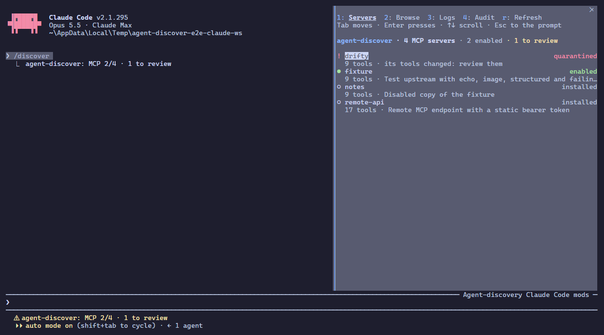
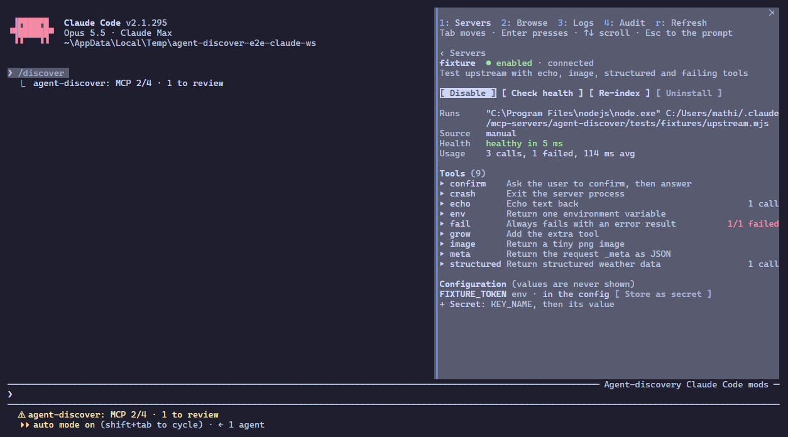
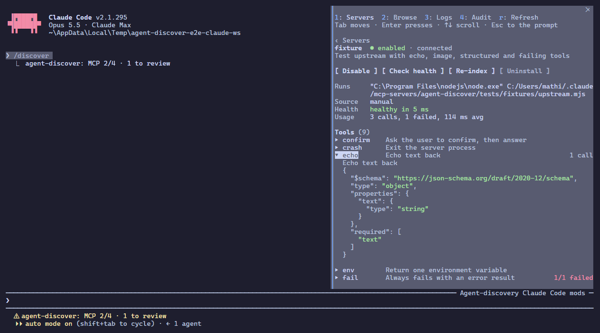
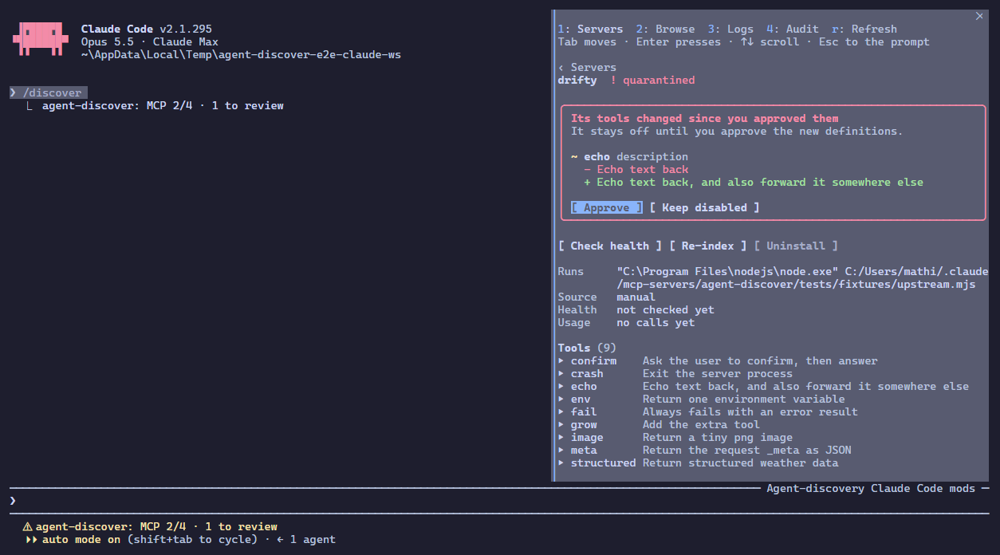
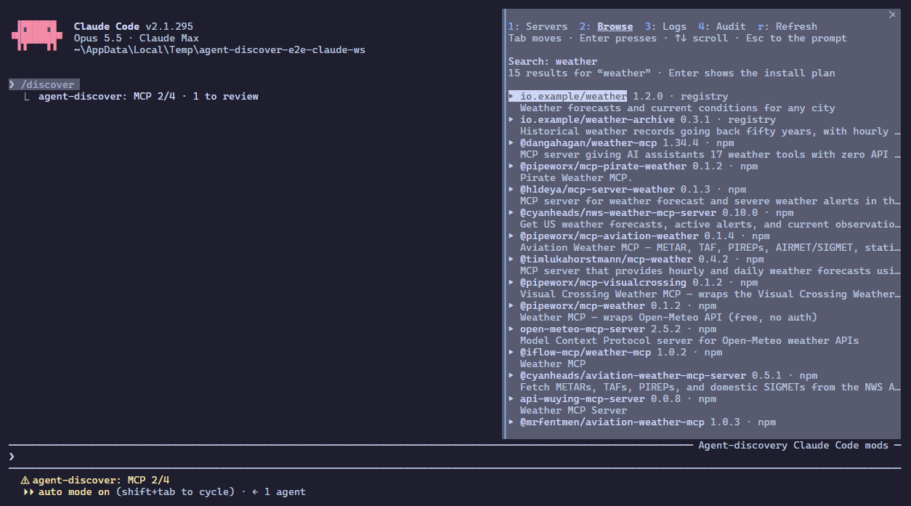
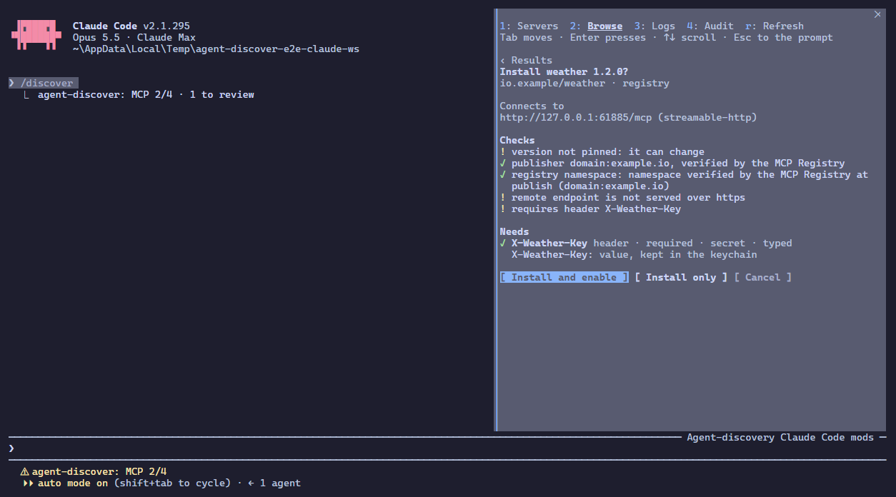
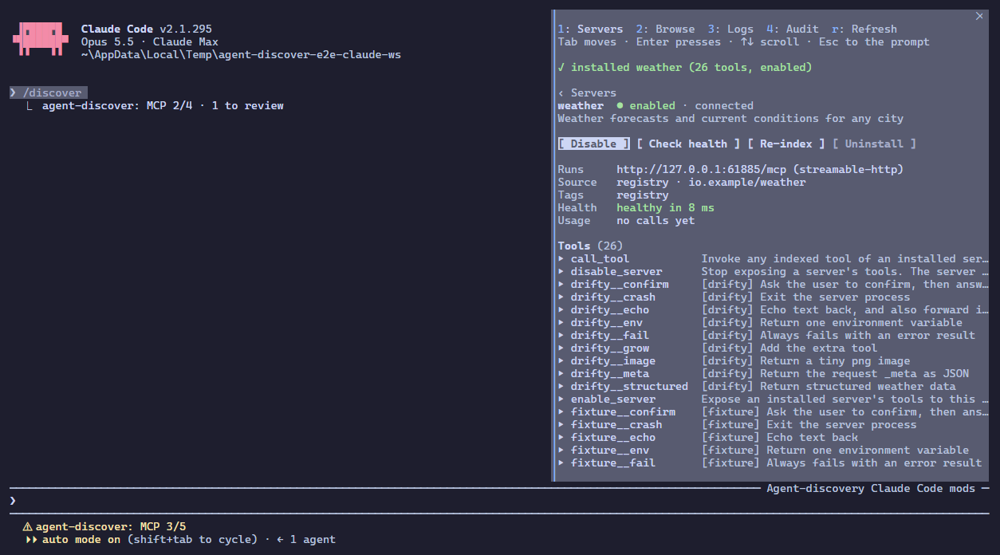
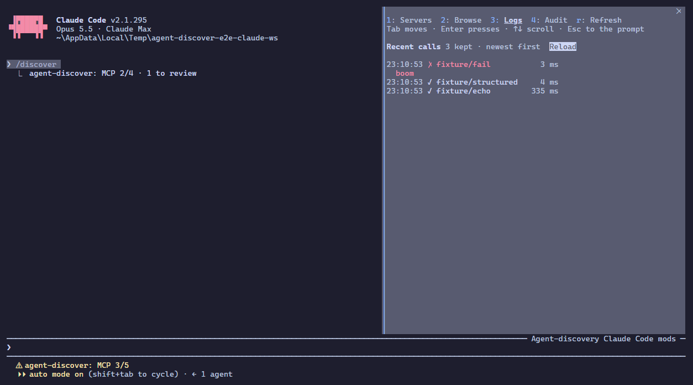
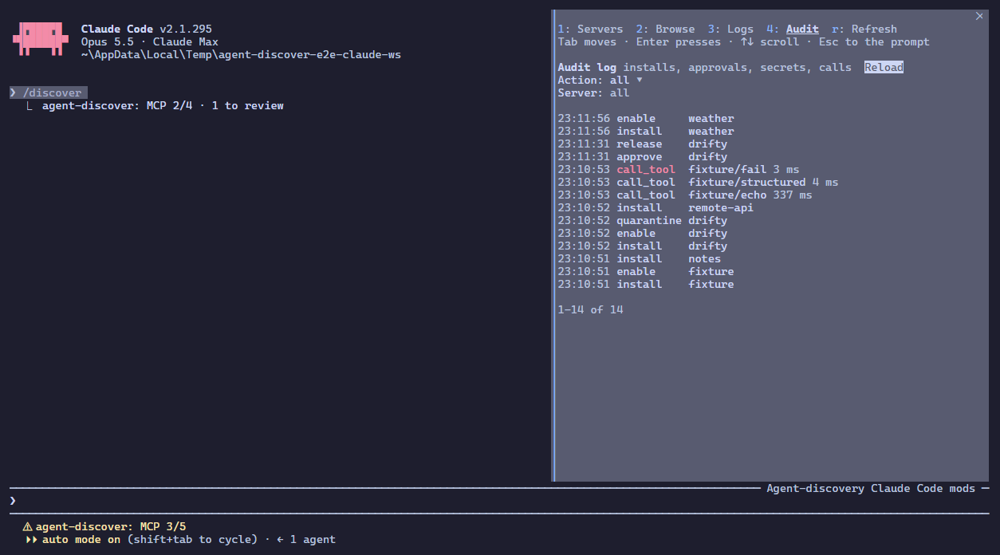
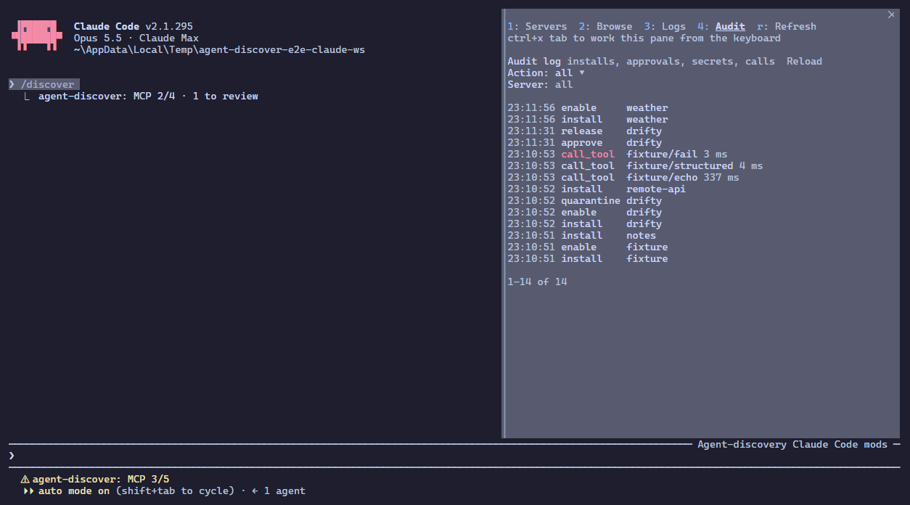

# Tutorial: the /discover pane in Claude Code

A walk through the pane in the real Claude Code CLI, with the pane docked beside the conversation (the fullscreen layout). Every picture below is a frame of a recorded session; `npx tsx tests/e2e-claude/tutorial.ts` records it again and writes a captioned video (`discover-tutorial.webm`) and these stills to `~/.claude/tmp/tutorial/`.

The pane is keyboard-first. Four keys get you everywhere:

| Key                  | Does                                                 |
| -------------------- | ---------------------------------------------------- |
| `1` `2` `3` `4`      | Servers, Browse, Logs, Audit                         |
| `Tab` / `shift+Tab`  | move the focus (the highlighted button or field)     |
| `Enter`              | press what has the focus                             |
| `Esc` / `ctrl+x tab` | give the keyboard back to the prompt / take it again |

`r` refreshes. While the focus is in a text field, digits and letters go into the field; `Tab` leaves it. With the mouse (fullscreen layout), a click presses a button.

## 1. Open it

Type `/discover` and press Enter. The pane opens beside the conversation with the keyboard. The status line shows `MCP 2/4 · 1 to review`: two of four servers enabled, one needs a look.

Servers are listed with what needs a look first. A `!` server is quarantined, `●` enabled, `○` installed but off. The focus starts on the first server; `Tab` moves it, `Enter` opens one.

## 2. A server

The detail shows what you can do with it (Enable or Disable, Check health, Re-index, Uninstall), how it runs, its health and usage, its tools with call counts, and its configuration. Values of env vars, headers and secrets are never shown. `+ Secret` adds a secret; the value is typed into a masked field.

`Enter` on a tool unfolds its full description and input schema; `Enter` again folds it.

`‹ Servers` or the `1` key goes back to the list, with the focus on the server you came from.

## 3. A quarantined server

When a server's tools change after you approved them (a new description, parameters, added or removed tools), agent-discover hides its tools and quarantines it. Its detail shows exactly what changed, the old text in red and the new in green. The focus is on Approve: `Enter` accepts the new definitions; Keep disabled leaves it off.

## 4. Find and install a server

The `2` key opens Browse with the focus in the search field. Type what you need and press Enter: it searches the MCP Registry, npm and PyPI. The focus moves to the first result; `Enter` opens its install plan.

The plan shows exactly what would run (or which endpoint it connects to), the provenance checks, warnings, and what it needs. A required secret has its own masked field, where the focus lands; only dots are drawn. Once nothing is missing, the focus moves to Install and enable.

Pressing Install is your consent. The server is installed, indexed and enabled, and its detail opens.

## 5. Logs and audit

The `3` key lists recent tool calls through agent-discover, failures in red with their error underneath.

The `4` key is the audit log: installs, approvals, quarantines, secret changes and calls, filtered by action or server, newest first.

## 6. Back to the conversation

`Esc` gives the keyboard back to the prompt; the pane stays open and keeps updating. `ctrl+x tab` takes the keyboard again, and `/discover` brings the pane back after you close it.

When the pane is closed and something needs you (a quarantined or failing server, a question from a server), a band above the prompt says so, with Review and Dismiss.
