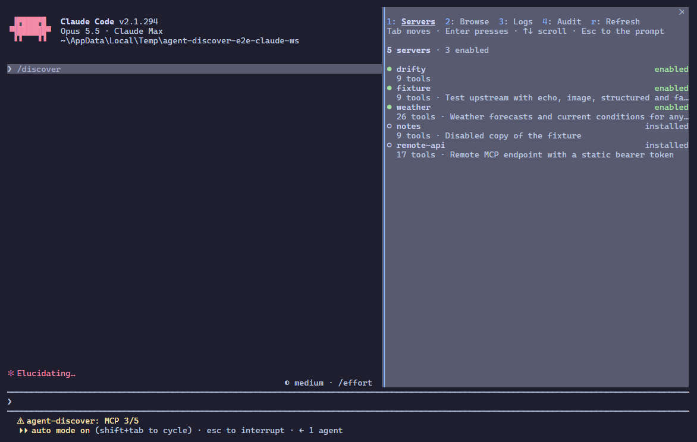
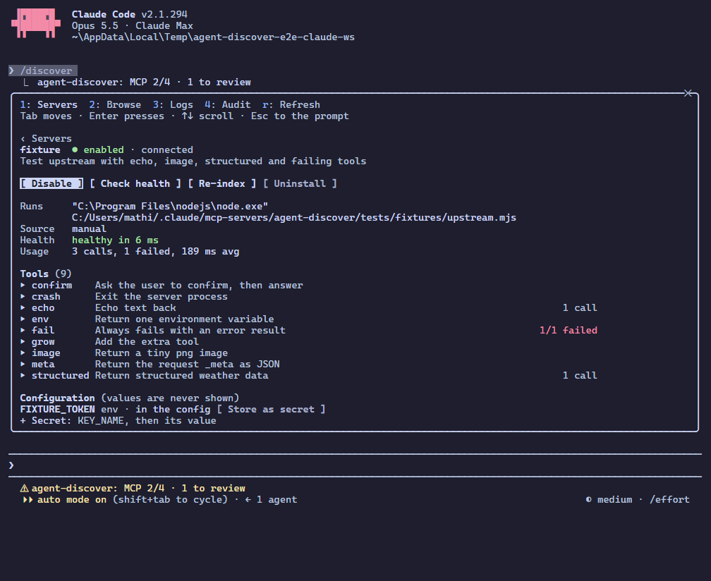

# agent-discover User Manual

For version 3.x. Looking for exact schemas? See [API.md](API.md). Installing for a specific client? See [SETUP.md](SETUP.md).

## Table of Contents

1. [What it is](#1-what-it-is)
2. [Install and connect](#2-install-and-connect)
3. [Everyday use](#3-everyday-use)
4. [The eight MCP tools](#4-the-eight-mcp-tools)
5. [Servers: install, enable, trust](#5-servers-install-enable-trust)
6. [Secrets and sign-in](#6-secrets-and-sign-in)
7. [The /discover pane in Claude Code](#7-the-discover-pane-in-claude-code)
8. [REST API in practice](#8-rest-api-in-practice)
9. [Declarative setup file](#9-declarative-setup-file)
10. [Operations](#10-operations)
11. [Troubleshooting](#11-troubleshooting)
12. [FAQ](#12-faq)

---

## 1. What it is

agent-discover lets an agent, or you, add MCP servers to a running session. It searches your installed servers' tools and the public registries (the official MCP Registry, npm, PyPI), installs a server after you approve the exact command, and exposes its tools to the host. It runs as one local daemon that every host shares; in Claude Code the `/discover` pane manages it.

Most hosts now have their own tool search. agent-discover does not replace it. It feeds it: enabled servers' tools are listed to the host as ordinary tools (native mode), and the host's search, permission prompts and deferred loading apply to them. What the host cannot do alone is find, install and enable a server it has never been configured with, without a config edit and a restart. That is the job here.

### Concepts

| Term            | Meaning                                                                                                          |
| --------------- | ---------------------------------------------------------------------------------------------------------------- |
| **Installed**   | The server is in the local database with its command or URL. It is not necessarily running.                      |
| **Indexed**     | Its tools were listed once and stored (with hashes). Installing indexes. The index is searchable while disabled. |
| **Enabled**     | Its tools are exposed to hosts. Disabling hides them but keeps the server installed and its index searchable.    |
| **Connected**   | A live connection to the upstream server exists. Connections are opened lazily and closed when idle.             |
| **Quarantined** | Its tools changed since you approved them. It is hidden and uncallable until you re-approve.                     |

Modes (`AGENT_DISCOVER_MODE`):

- **native** (default): enabled servers' tools appear as `<server>__<tool>`; the host is notified with `tools/list_changed`.
- **proxy**: only the eight meta tools are listed. Everything goes through `search_tools` and `call_tool`. For hosts that load every schema up front or ignore `list_changed`.

---

## 2. Install and connect

Requirements: Node.js 22 or newer. The servers you install may need `npx`, `uvx` or `docker` on the PATH.

**Claude Code:**

```bash
claude plugin marketplace add keshrath/agent-discover
claude plugin install agent-discover@agent-discover
```

**Any other host** (stdio):

```json
{
  "mcpServers": {
    "agent-discover": { "command": "npx", "args": ["-y", "agent-discover@^3"] }
  }
}
```

Hosts with Streamable HTTP can use `http://127.0.0.1:3424/mcp` if the daemon is running. Pick one entry per host; both would list every tool twice. Cursor, Codex, VS Code and Claude Desktop specifics are in [SETUP.md](SETUP.md#client-setup).

The shim that hosts spawn starts the daemon on first use. In Claude Code, `/discover` opens the management pane.

Removing a hand-written 1.x entry, a `session-start.js` hook, or both before installing the plugin avoids duplicate tools.

---

## 3. Everyday use

You mostly ask the agent for what you want. The `find` skill (Claude Code plugin) and the `discover` prompt make the agent follow this flow:

1. `search_tools` with a few phrasings of the need. It searches every installed server's index, enabled or not.
2. A hit on an enabled server: call the tool.
3. A hit on a disabled server: `enable_server`, then call it (or `call_tool` directly).
4. No hit: `search_servers` for something installable, then `install_server`. You see the exact command, pinned version and provenance, and approve or decline.

In Claude Code the `/discover [what you need]` command opens a pane with the same flow without involving the model: your servers (what needs a look first), each server's detail with Enable / Disable, Browse over the registries with the install plan, Logs and Audit ([section 7](#7-the-discover-pane-in-claude-code)). The status line shows `MCP 2/6 · 1 to review` (enabled of installed, and how many servers need attention). A toast appears when a server becomes quarantined or unhealthy.

Prompts `discover`, `install` and `status` are exposed over MCP and show up as slash commands in hosts that surface MCP prompts.

---

## 4. The eight MCP tools

Every tool except `call_tool` returns `structuredContent` plus a markdown rendering. Hosts that support MCP Apps (Claude Desktop, claude.ai, VS Code) render the `ui://agent-discover/app.html` widget. Claude Code does not render MCP Apps yet and shows the markdown.

### `search_servers`

`{ query, limit?, marketplace? }`. Installed servers matching the query, plus (unless `marketplace` is false) entries from the registry mirror, npm and PyPI. Each marketplace entry has the exact `name` to install, a status (`active`, `deprecated`, `deleted`), packages and remotes.

### `install_server`

`{ server?, source?, version?, name?, transport?, command?, args?, env?, url?, headers?, description?, tags?, enable? }`

- Registry, npm or PyPI: pass `server` (the exact name from `search_servers`), optionally `source` (default `registry`), `version` and `name` (the local name).
- Manual: pass `name` and `command` + `args` (stdio) or `url` + `transport` (`streamable-http` or `sse`).

agent-discover builds an install plan and asks you to confirm it through elicitation. You see the command line or URL, env and header names (and the value of any env var that changes what code runs, such as `NODE_OPTIONS` or `PATH`), the version (pinned or not) and the provenance checks. The confirmation is bound to a hash of that exact config. Then it installs, probes the server and stores its tools. `enable: true` also enables it.

`env` and `headers` are for manual installs only. If the local name already belongs to a different server, the call fails and asks for another `name`. Result `status`: `installed`, `already_installed`, `declined` or `consent_required` (the host cannot show an elicitation prompt; install from the `/discover` pane in Claude Code instead). `missing` lists required env vars or headers you still have to set as secrets. A probe failure is reported as `index_error`; the server stays installed.

### `enable_server` / `disable_server`

`{ name }`. Enabling indexes the server first if needed and exposes its tools. In native mode the host is notified of the change. A quarantined server shows you a diff of what changed and asks for re-approval. Disabling keeps the server installed and searchable.

### `server_status`

`{ name?, check_health? }`. For each server: enabled, quarantined (with the drift), indexed, connected, tool count, flagged tools, health, and `registry_status` (`deleted` when the registry entry it came from was taken down). `check_health: true` runs a live probe.

### `search_tools`

`{ queries: string[1..10], limit? }`. One result block per query, each with matches across all installed servers: server, tool, exposed name, description, `score` (0 to 1), whether the server is enabled, whether the tool is exposed, `required_args`, and `flags` if the description looks suspicious. Batch several needs in one call.

### `get_tool`

`{ server, tool }`. Full definition by direct lookup: input and output schema, annotations, `tool_hash`. A quarantined server's definition is withheld.

### `call_tool`

`{ server, tool, arguments? }`. Calls any indexed tool of an installed server, enabled or not, and returns the upstream result unchanged (images, resource links, `structuredContent` and `isError` included). This is how tools are reached in proxy mode. If the upstream asks the user a question mid-call, the question is relayed to your client.

---

## 5. Servers: install, enable, trust

### Where installs come from

- **MCP Registry**: a local mirror of the official registry, synced incrementally in the background on daemon start and when older than an hour, so search is fast and works offline. Entries with `deprecated` or `deleted` status are labelled; deleted entries are hidden from search.
- **npm** and **PyPI**: for servers that are not in the registry. npm search runs two queries so packages without the `mcp` keyword still show up. PyPI uses a curated list of well-known Python MCP servers plus a best-effort search.
- Package installs run via `npx -y <pkg>@<version>` (npm), `uvx` (PyPI) or `docker run` (OCI images); remote entries connect to their URL. Versions are pinned where the registry names an exact one (full semver for npm, a PEP 440 release for PyPI; ranges and dist-tags such as `next` are unpinned).

### Provenance checks

Each plan lists checks that pass, fail, are skipped or errored: the registry namespace matches the publisher, the npm package's `mcpName` points back at the registry entry, the PyPI project and OCI image carry the matching name or label. A `blocked` plan cannot be installed. These checks raise the cost of impersonation; they do not prove a server is safe.

### Tool pinning and quarantine

The first index of a server pins a hash of each tool's description, input schema and annotations. If a later index differs (a changed description, a new parameter, an added or removed tool), the server is quarantined: its tools vanish from the host, search and `get_tool`, and `call_tool` and `enable_server` are refused until you act.

To resolve it:

- through MCP, call `enable_server`; you get a readable diff of old and new descriptions, parameter changes, added and removed tools and hygiene flags, and can approve or decline;
- through REST, `GET /api/servers/:id/trust` for the report, then `POST /api/servers/:id/approve` with its `hashes`;
- if the server reverts to the pinned tools, the quarantine lifts by itself.

Re-indexing happens on upstream `list_changed` and on `POST /api/servers/:id/index` (the Re-index button).

### Description hygiene

Descriptions shown to models are stripped of invisible and bidirectional control characters and capped (1024 characters for tools, 512 for servers by default). Six heuristics flag text that looks like instruction override, hidden tags, exfiltration, secret access or concealment from the user. Flags show in `search_tools`, `get_tool`, `server_status` and the approval prompt. They are advisory.

### Health, errors and metrics

`POST /api/servers/:id/health` (or Check health in `/discover`) runs a real ping or `server/discover` probe. Failures raise the server's error count; a healthy probe resets it. Per-tool call counts, errors and latency are recorded for every proxied call (`GET /api/servers/:id/metrics`, `GET /api/metrics`) and also feed a small usage prior in search ranking. The call log (last 500 calls in memory, 30-day retention by default) is in the Logs tab of `/discover` (`GET /api/logs`).

### Audit log

Installs, approvals, denials, enable and disable, uninstall, quarantine and release, hygiene flags, secret changes and every `call_tool` are appended to `audit_log`. Read it with `GET /api/audit`. Call arguments are recorded only when `AGENT_DISCOVER_AUDIT_ARGS=1`, with secret-looking values masked.

### OpenTelemetry

Set `OTEL_EXPORTER_OTLP_ENDPOINT` (or `AGENT_DISCOVER_OTEL=1`) to emit a span per tool call and per upstream hop, with W3C trace context passed through to the upstream server. Off by default; needs the optional `@opentelemetry/api` and `@opentelemetry/sdk-node` packages.

---

## 6. Secrets and sign-in

### Secrets

API keys and tokens for a server are stored as secrets, not in its `env`. Values go to the OS keychain (service `agent-discover`); where no keychain is available they go to an AES-256-GCM file next to the database. SQLite holds only key names. On connect, secrets are injected as environment variables (stdio servers) or HTTP headers (remote servers). Listing always shows `********`.

```bash
TOKEN=$(curl -s http://127.0.0.1:3424/api/token | node -pe 'JSON.parse(require("fs").readFileSync(0)).token')
curl -X PUT http://127.0.0.1:3424/api/servers/3/secrets/GITHUB_TOKEN \
  -H 'Content-Type: application/json' -H "X-Agent-Discover-Token: $TOKEN" \
  -d '{"value":"ghp_..."}'
```

The Configuration and secrets section of a server in `/discover` does the same, through a masked field. `server_status` and install results list required secrets that are missing.

`AGENT_DISCOVER_SECRETS=keyring` or `file` forces a backend. Secrets saved in plaintext by 1.x are moved into the backend on first start and wiped from SQLite.

### OAuth for remote servers

A remote (`sse` or `streamable-http`) server that needs OAuth and has no `Authorization` header configured is signed in with OAuth 2.1: discovery, PKCE, refresh and the issuer check run automatically. When a call needs sign-in:

- if your client supports URL-mode elicitation, it gets a sign-in link; finish in the browser and the call resumes (up to 5 minutes);
- otherwise the call returns an error containing the URL.

`GET /api/servers/:id/auth` reports `authorized`, `required` or `unknown` (no sign-in was ever asked for, as with a static `Authorization` header; the pane then shows no sign-in); `POST` starts sign-in. The callback is `http://127.0.0.1:<port>/oauth/callback`. agent-discover never opens the URL itself. Tokens are stored as secrets. Changing the daemon's port needs a fresh sign-in (the client registration is bound to the redirect URI).

---

## 7. The /discover pane in Claude Code

A step-by-step walk through with screenshots: [TUTORIAL.md](TUTORIAL.md).





agent-discover has no web dashboard since 3.0. Its management UI lives inside Claude Code (plugin, 2.1.289+); other hosts use the MCP tools, and Claude Desktop, claude.ai and VS Code also render the MCP Apps widget on results.

- `/discover` opens the agent-discover pane, docked beside the transcript in the fullscreen layout and above the prompt otherwise (also the desktop Code tab and VS Code). Tabs:
  - **Servers**: every installed server on two lines, what needs a look first: its name and state (enabled, installed, quarantined, unhealthy), then its tool count and description (or why it is quarantined or unhealthy). Open one for its detail, top down: for a quarantined server the drift (changed, added, removed tools; a changed description shows the approved text and the new one) with Approve and Keep disabled; Enable or Disable, Re-index, Check health, Reset errors and Uninstall (asks once more); the exact command or URL, source and MCP Registry name and status, package and version, tags; health (an enabled server is checked when its detail opens, otherwise the last check and when it ran, or "not checked yet"); usage (calls, failures, average latency); for a remote server that asked for OAuth the sign-in state with Sign in and the authorization URL as a link (agent-discover never opens it; a server with a static `Authorization` header shows none); its tools, one line each with the description's first line and per-tool calls, each unfolding to its full description and input schema; and **Configuration and secrets**: every env var and header key with where its value comes from (a keychain secret, a value in the config, or missing), never the value itself, with Set secret, Replace and Delete. A secret is typed into a masked field drawn as dots (a new one asks for its key first); the value is sent once and never kept in the pane's state.
  - **Browse**: search the registry mirror, npm and PyPI, sync the mirror; open a result for its install plan: the exact command or URL, pinned version, publisher and provenance checks, warnings or the reason it is blocked, and its env and header requirements with an input for each missing one (masked for secrets). Install or Install and enable sends `POST /api/install`; you pressing it is the consent.
  - **Logs**: the recent proxied calls with latency and errors. **Audit**: the audit log, filtered by server and action, paged.
  - Questions upstream servers ask (elicitation) that no client could answer show on top, with a field per requested value and Accept, Decline, Cancel.
- `/discover <what you need>` opens Browse with the results for that query.
- The pane opens with the keyboard: 1-4 switch tabs and r refreshes (not while the ring is in a text field, which takes the keys), Tab and shift+Tab walk its buttons and fields, Enter presses, the arrows scroll, and Esc hands the keys back and leaves it open; ctrl+x tab takes them again. A hint line under the tabs says which applies. After every move the ring lands on the likely next step: the first server, Approve or Enable in a detail, the search field (or the first result once there are results), a missing install secret and then Install and enable, and the row a detail was opened from. Inline above the prompt it asks for 40 rows; a size you set wins. Times are local.
- A status line entry `MCP 2/6 · 1 to review` (enabled of installed, and how many servers need a look).
- A toast when a server becomes quarantined or unhealthy, or an upstream server asks a question.
- A band above the prompt, shown only while something needs you and the pane is closed, with Review (opens the server in the pane) and Dismiss.
- A context block in each conversation's first message telling the model what is enabled and to search before giving up.

The pane talks to the daemon's REST API only (state-changing calls with the per-launch token). It refreshes the status every 30 seconds, every 5 seconds while the pane is open, and after every action. If the engine does not place the pane (a terminal too narrow for an unasked pane, a surface that places none), `/discover` prints why. Set `AGENT_DISCOVER_PORT` in the environment if the daemon is not on 3424.

---

## 8. REST API in practice

Everything the pane does is available over REST ([API.md](API.md)). Reads need nothing. Every POST, PUT, PATCH and DELETE needs the per-launch token:

```bash
BASE=http://127.0.0.1:3424
TOKEN=$(curl -s $BASE/api/token | node -pe 'JSON.parse(require("fs").readFileSync(0)).token')

curl -s "$BASE/api/status"                               # servers and their state
curl -s "$BASE/api/browse?query=postgres&limit=5"        # registry + npm + PyPI
curl -s "$BASE/api/install/plan?name=io.github.org/server" # preview an install
curl -s -X POST $BASE/api/install \
  -H 'Content-Type: application/json' -H "X-Agent-Discover-Token: $TOKEN" \
  -d '{"name":"io.github.org/server","enable":true}'
curl -s -X POST $BASE/api/servers/3/disable -H "X-Agent-Discover-Token: $TOKEN" -H 'Content-Type: application/json'
```

`POST /api/install` is the pane's install and, unlike the MCP tool, has no elicitation step: the person pressing Install in the pane is the consent. Only loopback `Host` headers are accepted, and requests from web pages (any `Origin`) are refused.

---

## 9. Declarative setup file

Point `AGENT_DISCOVER_SETUP_FILE` at a JSON file to have servers ensured at daemon start. It is idempotent (existing servers are kept, secrets re-synced) and a sibling `*.local.json` is merged for machine-specific servers.

```json
{
  "servers": [
    {
      "name": "docs",
      "transport": "streamable-http",
      "url": "https://example.com/mcp",
      "secrets": { "AUTHORIZATION": "$DOCS_TOKEN" },
      "enabled": true
    },
    {
      "name": "fs",
      "command": "npx",
      "args": ["-y", "@modelcontextprotocol/server-filesystem", "."]
    }
  ]
}
```

`$NAME` values resolve from the daemon's environment. `enabled: true` enables after install. The 1.x key `auto_activate` was renamed to `enabled`; an entry still using the old key is reported as an error instead of being applied. Setup-file entries are operator-authored and skip the consent prompt. `POST /api/sync` re-reads the file.

---

## 10. Operations

- **Daemon lifetime.** Exits after 30 minutes with no open HTTP exchanges (`AGENT_DISCOVER_IDLE_MS`, `0` = never). The next shim start brings it back. For an always-on daemon see the systemd example in [SETUP.md](SETUP.md#running-as-standalone-server).
- **Data.** Database `agent-discover.db` in the data directory (`AGENT_DISCOVER_DATA_DIR`, else `%LOCALAPPDATA%\agent-discover` on Windows, `~/Library/Application Support/agent-discover` on macOS, `~/.local/share/agent-discover` on Linux; `AGENT_DISCOVER_DB` overrides the file). A 1.x database in `~/.claude` is moved there once on first start. Back it up by copying the file with the daemon stopped. Secret values are in the keychain or the encrypted file beside the database, not in the database.
- **Upgrading from 2.x.** Host configs move to `agent-discover@^3`. The web dashboard is gone: use `/discover` in Claude Code, the MCP tools elsewhere.
- **Upgrading from 1.x.** The database migrates itself. Re-run host config to the current entry (`agent-discover@^3`), rename `auto_activate` to `enabled` in setup files, and update scripts for the REST renames listed in the [changelog](../CHANGELOG.md).
- **Embeddings.** Optional. See [SETUP.md](SETUP.md#semantic-search-optional).

---

## 11. Troubleshooting

**`/discover` says the daemon is not reachable.** `curl http://127.0.0.1:3424/api/health`. If it fails, run `agent-discover daemon` in a terminal and read the output. The daemon started by a shim logs to `daemon-<port>.log` in the data directory.

**`/discover` prints status but no pane appears.** It prints `pane not shown: <reason>` when Claude Code did not place it; widen the terminal or open it again. The pane is a plain sidebar: Escape hands the keys back without closing it, and ctrl+x x (or its close mark) closes it.

**Tools do not appear after enabling.** Check `server_status` for `quarantined`, `indexed` and `index_error`; run a health check; run the server's command by hand. In proxy mode tools are never listed: use `call_tool`. If the host ignores `list_changed`, switch to proxy mode.

**Tools appear twice.** The plugin and a hand-written entry are both configured. Keep one.

**Install says `consent_required`.** The host cannot show an elicitation prompt. Install from Browse in Claude Code's `/discover` pane.

**Marketplace search is empty.** The registry mirror may not have synced yet (`GET /api/registry`; `POST /api/registry/sync` forces it), or the network blocks the registries. `GET /api/browse` reports per-source errors.

**`uvx not found`.** Install [uv](https://docs.astral.sh/uv/) so Python servers can start.

**403 `TOKEN_REQUIRED`.** A mutating REST call without `X-Agent-Discover-Token`. Fetch it from `GET /api/token`.

**Database problems.** Stop the daemon, delete `agent-discover.db` in the data directory and restart. Installed servers, metrics, pins and the audit log are lost.

---

## 12. FAQ

**Does it work with hosts other than Claude Code?** Yes. Any MCP host that can run a stdio command or speak Streamable HTTP. The native UI (panel, status line, toasts) is Claude Code only.

**Is `/discover` a model call?** No. The panel and the status line talk to the daemon directly.

**Why no more `registry` tool?** 2.0 replaced the single action tool with eight named tools with annotations and output schemas, so hosts can reason about read-only versus destructive calls.

**Can I still search tools of servers I have disabled?** Yes. The index covers every installed server. Enabling only controls what the host sees.

**Does it send my tool descriptions anywhere?** Only to the embedding provider you opt into. Search is local by default. See [PRIVACY.md](../PRIVACY.md).

**How many servers can be enabled?** Each enabled server's tools are listed to the host in native mode, so the limit is your host's tool budget. Disabled servers cost nothing at the host.

**What does it not protect against?** Upstream stdio servers run with your user's privileges; sandboxing is not in 2.0. See [SECURITY.md](SECURITY.md).
